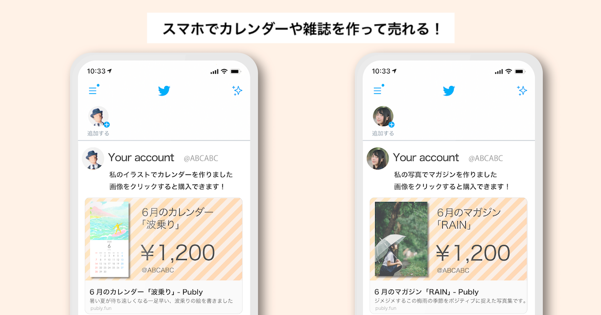

# What's company?

## 受託業務

IoT / Mobile / Webの開発業務についてのご相談を承っています。IoTプロダクトの開発については、 企画、部品選定、通信プロトコル設計、アプリ・Web開発、量産立ち上げなど、一気通貫・ワンストップで支援可能です。

具体的な仕様がないといった状況でも、お気軽にご相談ください。

[開発事例](case/README.md) はこちらを参照ください。

## 代表者経歴

- 2009年：インターネット接続型家電の企画・開発・販売を行う会社に入社。サーバーサイドエンジニアとして創業時を担う。  
- 2011年：BLE製品を個人で開発し、所属会社で量産製品化、USA・EU圏・日本で発売。  
- 2013年：PMとしてエンジニアを率い、企画から発売までマネージメントや仕様策定、量産工場選定・立ち上げを、日米共同プロジェクト他、会社の主力商品を担当。  
- 2017年：1年のフリーランスを経て、プロダクトデザイナーと共同で1社目設立。設立と同時に初製品を企画から製造のみならず、広報・販路拡大やユーザサポート等、商品全てを自身の手のみで実践。それら経験を活かし、小ロット生産を得意としたIoT機器開発の支援やWeb・モバイルなどシステム開発を主軸に事業展開。  
- 2021年：共同代表に株式売却、退職。同年8月に現会社を設立。Webシステム、モバイル・デスクトップアプリ、Web3（NFT・ブロックチェーン）、生成系AI活用、IoT機器等幅広く知見を活かした受託や開発顧問を行う事業をスタート。
現在は、生成系AI x IoT x Web技術の開発力で、大企業からベンチャー、中小企業をクライアントに受託開発、月定額のPdM・エンジニアリングサービスを軸に、生成系AIの活用したIoTゲートウェイの開発や、中小企業に対する生成系AI活用の社会実装を研究・開発中。  

## 得意領域

- 純粋なアイデアレベルから、初期プロダクトにおける重要な提供価値を見定め、どう開発を実施していくべきか、実現可能な仕様やスケジュールに落とし込むこと。またそれを継続すること。  
- プロダクトオーナーと対話し、品質とスピード、その他リスクなどトレードオフの要素を整理し、オーナーが意思決定しやすい形で伴走すること。  
- プロダクト開発に応じたプロジェクトのロードマップを作成。どんな製品にも基本的に存在するマイルストーンを、プロジェクトの特徴にカスタマイズ。現在の課題を整理し、自社・協力会社で誰が何をいつまでにどうするのか、問題把握と解決のために細分化して検討すること。  
- プロダクトに足りないピースを調達。もしくは社内メンバーへのレクチャー。  
- プロダクト成長に備えた、資産活用・技術選定。  
- これらのことを一人で完結できること（もちろんチーム開発で行う経験も多数）  

## 取引先

- 大手直接契約：パナソニック、ダイキン、ローランド 他
- 創業間もないベンチャーから成長中の企業まで様々
- [株式会社みんてく](https://www.minteku.com/)
  - 経営メンバーとして参画中 

## 自社プロダクト

### DIMBULA

実機モバイルのCIプロダクト「[DIMBULA](https://dimbula.kunimasu.com/)」を開発・運営しています。

Githubと連携し、モバイルアプリ、WebサービスのE2Eテストをノーコード且つ弊社マネージドな環境で提供します。 
また、カスタマーサポートでお客さまご利用の実機でデバッグする必要があった場合など、スポットで実機をリモートデスクトップのように利用したいケースでもご利用頂けます。

### Publy

「[Publy | スマホでカレンダーや雑誌を作って売れる！](https://publy.fun/)」は、スマホで好きな写真や画像を選択して簡単にオリジナルカレンダーや雑誌を作って売れるサービスです。受注生産なので在庫リスクはゼロ。発送までPublyが行います。

### オシタテシヨウ

「[オシタテシヨウ](https://oshitate.kunimasu.com/)」は、天然石のお仕立て品を披露するサービスです。天然石を指輪などにお仕立てしたお客さまが投稿する お仕立て品のデータベースサービスです。

### オムカエシヨウ

「[オムカエシヨウ](https://omukae.kunimasu.com/)」は、天然石を購入したユーザがお迎えしたツイートをまとめるサービスです。お客さまがお迎えしたツイートを口コミのようにまとめて閲覧できるようになっています。

## テックブログ

* [Zenn](https://zenn.dev/kunimasu)

# About us

<label>名称</label>
株式会社Kunimasu 
よみ：かぶしきかいしゃ くにます

<label>代表取締役</label>
國舛 等志 
よみ：くにます ひとし

<label>設立</label>
2021年8月5日

# 事業内容

* Webサービス / ネイティブアプリ / IoT の受託開発（請負、準委任）
* 月額制エンジニアリングサービス（仕様を一緒に作っていく段階でジョイン出来ます）
* 自社プロダクト開発・運営
* 天然石販売
  * [\_\_picgem\_\_]( ) - Twitter
  * [直販サイト](https://picgem.kunimasu.com/) - BASE支店
* 自家珈琲焙煎・販売

# 株式会社みんてく
経営に参画している株式会社みんてくについて、以下から詳細を確認できます。

- [株式会社みんてく](https://www.minteku.com/)
- [みんてくのサービス](https://www.minteku.com/services)
- [みんてくの生成AI活用](https://www.minteku.com/generation-ai)
- [みんてくについて](https://www.minteku.com/about)
- [みんてくへお問い合わせ](https://www.minteku.com/contact)

## AIクイックスタート
みんてくは、10万円で生成AIアプリの開発を2週間 ~ お届けするサービス「AIクイックスタート」を始めました。

最新AI技術活用を10万から初められる特別プラン！  
～ 今すぐ始められる、AI活用の第一歩 ～  

生成AI導入の課題である「高コストへの不安」「長期開発の懸念」「専門知識の必要性」に対して、安心してご利用いただけるプランをご用意しています。

[AIクイックスタート](https://www.minteku.com/aiquickstart)

ローカルLLM導入、生成AIアプリ開発、Dify導入などに関しては、是非ご活用ください。

# Contact us

<form method="post" action="https://hyperform.jp/api/MWZhqUoq">
  <label>お名前</label>
  <input name="お名前" type="text" required autocomplete="name">
  <label>メールアドレス</label>
  <input name="email" type="email" required autocomplete="email">
  <label>お問い合わせ内容</label>
  <textarea name="お問い合わせ内容" style="height: 20vh;"></textarea>
  <label>個人情報の取り扱いについて</label>
  <textarea readonly style="height: 20vh;">プライバシーポリシー
株式会社Kunimasu（以下「当社」といいます）は、当社が提供するサービス（以下「本サービス」といいます）におけるユーザー（本サービスを利用する方に加え、当社ウェブサイトを閲覧する方も含みます）についての個人情報を含む利用者情報の取扱いについて、以下のとおりプライバシーポリシー（以下「本ポリシー」といいます）を定めます。

（総則）
当社は、利用者情報の保護実現のため、個人情報保護法、各省庁ガイドラインその他関連する法令等を遵守します。
本ポリシーは、本サービスの利用に関し適用されます。また、当社が、当社の運営するウェブサイト及びアプリケーション上に掲載するプライバシーポリシーその他の個人情報保護方針または本サービスに関する利用規約等において、利用者情報の取扱いについて規定する場合、当該規定も適用され、当該規定が本ポリシーと抵触する場合には、本ポリシーが優先されます。
提携パートナーにより提供される提携サービスその他当社以外の第三者が提供するサービス（以下「外部サービス」といいます）については、本ポリシーの各規定は適用されません。これらのサービスにおける利用者情報の取扱いについては、外部サービスを提供する事業者が定めるプライバシーポリシー等をご参照ください。

（収集する利用者情報）
利用者情報のうち「個人情報」とは、個人情報保護法にいう「個人情報」を指すものとし、生存する個人に関する情報であって、当該情報に含まれる氏名、生年月日、住所、電話番号、連絡先その他の記述等により特定の個人を識別できる情報を指します。利用者情報のうち「履歴情報および特性情報」とは、「個人情報」以外の情報をいい、ご利用いただいたサービス、ご利用日時、ご利用の方法、ご利用環境、郵便番号や性別、職業、年齢、クッキー情報、位置情報、端末の個体識別情報などを指します。

（利用者情報の収集方法）
当社は、ユーザーが本サービスを利用する際に氏名、生年月日、住所、電話番号、メールアドレス、銀行口座番号、クレジットカード番号などの個人情報をお尋ねすることがあります。また、ユーザーと提携先などとの間でなされたユーザーの個人情報を含む取引記録や、決済に関する情報を当社の提携先（情報提供元、広告主、広告配信先などを含みます。以下｢提携先｣といいます）などから収集することがあります。
当社は、ユーザーについて、利用したサービス、利用日時、利用方法、利用環境（携帯端末を通じてご利用の場合の当該端末の通信状態、利用に際しての各種設定情報なども含みます）、クッキー情報、位置情報、端末の個体識別情報などの履歴情報および特性情報を、ユーザーが当社のサービスを利用しまたはページを閲覧する際に収集します。

（利用する目的）
当社は、利用者情報を、以下の各号に定める目的のために利用します。
本サービスの提供にあたり必要な情報を利用する目的
ユーザーにお知らせや連絡をするためにメールアドレスを利用する場合やユーザーに商品を送付したり必要に応じて連絡したりするため、氏名や住所などの連絡先情報を利用する目的
ユーザーの本人確認を行うために、氏名、生年月日、住所、電話番号、銀行口座番号、クレジットカード番号、運転免許証番号、配達証明付き郵便の到達結果などの情報を利用する目的
ユーザーに対価を請求するために、商品名や数量、利用されたサービスの種類や期間、回数、請求金額、氏名、住所、銀行口座番号やクレジットカード番号などの支払に関する情報などを利用する目的
ユーザーが簡便にデータを入力できるようにするために、当社に記録されている情報を入力画面に表示させたり、ユーザーのご指示に基づいて他のサービスなど（提携先が提供するものも含みます）に転送したりする目的
対価の支払を遅滞したり第三者に損害を発生させたりするなど、本サービスの利用規約に違反したユーザーや、不正・不当な目的でサービスを利用しようとするユーザーの利用をお断りするために、利用態様、氏名や住所など個人を特定するための情報を利用する目的
ユーザーからのお問い合わせに対応するために、お問い合わせ内容や対価の請求に関する情報など当社がユーザーに対してサービスを提供するにあたって必要となる情報や、ユーザーのサービス利用状況、連絡先情報などを利用する目的
上記の利用目的に付随する目的
当社は、前項に定めるほか、以下の表に定める目的でも利用者情報を利用します。
【表】

利用目的

対応する利用者情報の項目

当社のサービスに関連して、個人を識別できない形式に加工した統計データを作成するため
・端末情報

・ログ情報

・クッキー情報

・位置情報

当社または第三者の広告の配信または表示のため
・端末情報

・ログ情報

・クッキー情報

・位置情報

アンケート調査その他マーケティングに利用するため
・氏名

・メールアドレス

・生年月日

・性別

・その他当社が定める入力フォームにユーザーが入力する情報

（利用者情報の第三者提供）
当社は、個人情報保護法その他の法令で認められる場合を除いて、あらかじめユーザーの同意を得ることなく、第三者に利用者情報を提供することはありません。

（個人情報の開示）
当社は、本人から個人情報の開示を求められたときは、本人に対し、遅滞なくこれを開示します。ただし、個人情報保護法その他の法令により開示しないことが認められる場合は、その全部または一部を開示しないこともあり、開示しない決定をした場合には、その旨を遅滞なく通知します。
前項の定めにかかわらず、履歴情報および特性情報などの個人情報以外の情報については、原則として開示いたしません。

（個人情報の訂正および利用停止等）
当社は、ユーザーから、個人情報保護法の定めに基づきその利用の停止を求められた場合には、ユーザーご本人からのご請求であることを確認の上で遅滞なく必要な調査を行い、その結果に基づき、個人情報の内容の訂正または利用停止を行い、その旨をユーザーに通知します。なお、合理的な理由に基づいて訂正または利用停止を行わない旨の決定をしたときは、ユーザーに対しその旨を通知いたします。
当社は、ユーザーから、ユーザーの個人情報について消去を求められた場合、当社が当該請求に応じる必要があると判断した場合は、ユーザーご本人からのご請求であることを確認の上で、個人情報の消去を行い、その旨をユーザーに通知します。
個人情報保護法その他の法令により、当社が訂正等または利用停止等の義務を負わない場合は、前2項の規定は適用されません。

（お問い合わせ窓口）
本ポリシーに関するお問い合わせは、お問い合わせ窓口までお願いいたします。

【お問い合わせ窓口】

株式会社Kunimasu

個人情報保護管理責任者：國舛等志

連絡先：〒105-0013 東京都港区浜松町２丁目２番１５号浜松町ダイヤビル２Ｆ

メールアドレス：cs@kunimasu.com

（プライバシーポリシーの変更）
当社は、利用者情報の取扱いに関する運用状況を適宜見直し、継続的な改善に努めるものとし、必要に応じて、本ポリシーを変更することがあります。変更した場合には、本サービスに表示する方法でユーザーに通知いたします。ただし、法令上ユーザーの同意が必要となるような内容の変更の場合は、当社所定の方法でユーザーの同意を得るものとします。

2022年5月13日制定</textarea>
  

    <input name="個人情報の利用についての同意" id="consent-check" type="checkbox" value="同意します" required>
    <label for="consent-check">個人情報の利用についての同意</label>
  

  <button type="submit">お問い合わせを送信する</button>
</form>
